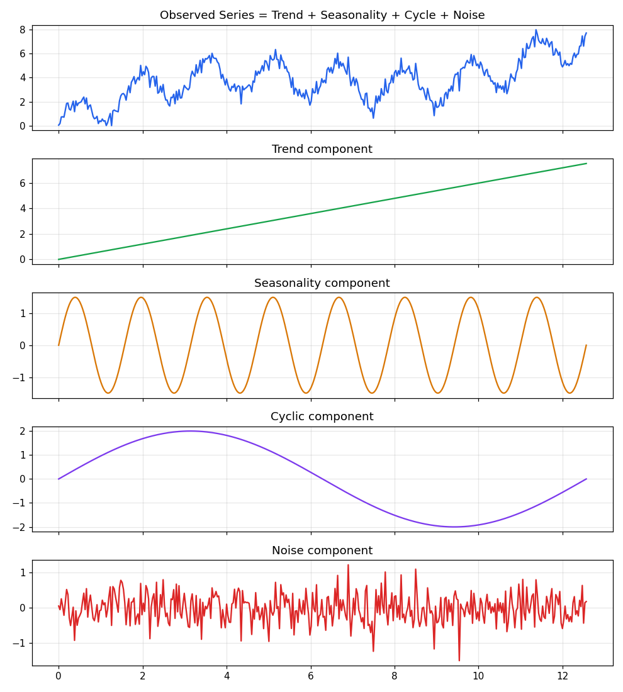
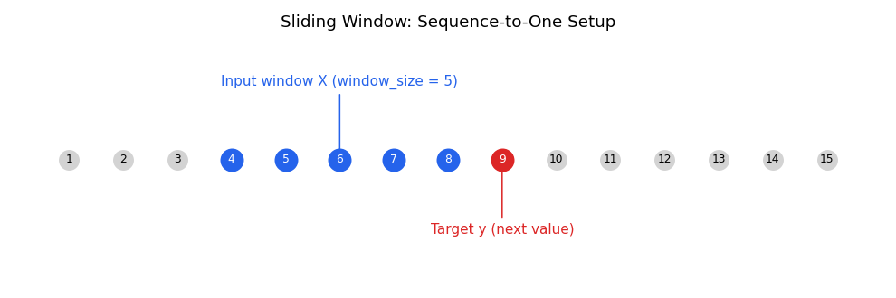
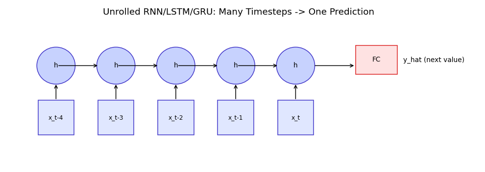
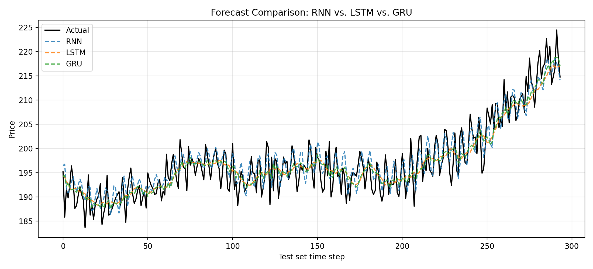

# Sequence Modeling for Time-Series Forecasting
## Stock Price Prediction using RNN, LSTM, and GRU

A complete, end-to-end project comparing three sequence architectures — **Simple RNN**, **LSTM**, and **GRU** — for univariate time-series forecasting, using stock price data as the case study.


## Contents of This Package

| Deliverable | Location |
|---|---|
| Jupyter Notebook (theory + full code, pre-executed) | `Time_Series_Forecasting_RNN_LSTM_GRU.ipynb` |
| Source Code | `src/`, `data/generate_data.py` |
| Saved Models (`.pth`) | `saved_models/` |
| Forecast Graphs | `outputs/` |
| Performance Comparison Table | `outputs/performance_comparison.csv`, `outputs/performance_comparison_table.png` |
| Presentation (10 slides) | `Time_Series_Forecasting_Presentation.pptx` |
| Presentation — Sutskever et al. 2014 (Seq2Seq paper) | `Seq2Seq_Sutskever2014_Presentation.pptx` |
| Research Paper Review (2024, eGRU) | `Paper_Review_eGRU.docx` |
| This README | `README.md` |


## 1. Theory

### 1.1 Introduction to Time-Series Data
A **time series** is a sequence of observations ordered in time (e.g. daily stock closing prices). Unlike ordinary tabular data, **order matters** and nearby observations are typically correlated. Forecasting uses past values to predict future ones.

### 1.2 Components of a Time Series

| Component | Description |
|---|---|
| **Trend** | Long-term increase/decrease (e.g. multi-year growth of a stock). |
| **Seasonality** | Regular, fixed-period fluctuations (daily/weekly/yearly). |
| **Cyclic Patterns** | Longer, irregular fluctuations not tied to a fixed calendar period (e.g. economic cycles). |
| **Noise** | Random, unpredictable leftover variation. |

```
Observed(t) = Trend(t) + Seasonality(t) + Cycle(t) + Noise(t)
```



### 1.3 Sliding Window Technique & Sequence-to-One Prediction
RNN/LSTM/GRU models need fixed-length inputs. The **sliding window** technique turns a raw series into `(X, y)` training pairs:

- `X` = `window_size` consecutive past values
- `y` = the single next value (this is **sequence-to-one** prediction)
- The window slides forward by 1 step each time.



**Sequence length (window size)** is a key hyperparameter — too short and the model misses longer-term patterns; too long and training becomes slower with a higher risk of overfitting and vanishing gradients (especially for plain RNNs).



### 1.4 Forecasting Evaluation Metrics

| Metric | Formula | Meaning |
|---|---|---|
| **MAE** | mean(\|y − ŷ\|) | Average absolute error, same units as data |
| **MSE** | mean((y − ŷ)²) | Penalizes large errors more |
| **RMSE** | √MSE | Same units as data, easier to interpret than MSE |
| **R² Score** | 1 − SS_res / SS_tot | Fraction of variance explained (1.0 = perfect) |

### 1.5 Challenges in Time-Series Forecasting
- Non-stationarity (statistics change over time)
- Separating genuine signal from noise
- Long-range dependence / vanishing gradients in plain RNNs
- Sudden regime shifts / structural breaks
- Limited *effective* sample size due to autocorrelation
- Overfitting to a specific historical backtest window


## 2. Project

### Dataset
This project uses **real daily price data for Apple Inc. (AAPL)** — `data/apple_stock_prices.csv`, covering **1255 trading days from 2020-06-04 to 2025-06-02**, with columns `Date, Open, High, Low, Close, Volume` and no missing values. Only the `Close` price is used as the forecasting target.

The pipeline is dataset-agnostic — swap in any other Tesla/Google/weather/power-consumption CSV with the same schema at `data/` and every downstream step works unchanged.

### Methodology / Pipeline
```
Raw Stock Data → Clean & Normalize → Sliding Window → Train RNN/LSTM/GRU → Evaluate → Compare & Forecast
```
- **Window size:** 20 days
- **Train/Test split:** 80/20, chronological (no shuffling — avoids leaking future data into training)
- **Architecture (all 3 models, matched capacity):** 1 recurrent layer, 24 hidden units (scale up to 2 layers / 64 units for a heavier run)
- **Optimizer / Loss:** Adam, MSE
- **Epochs / Batch size:** 40 / 32

### Tasks Implemented
1. **Data Preprocessing** (`src/preprocessing.py`): load → interpolate missing values → MinMax normalize → sliding-window sequences → chronological train/test split.
2. **Model Development** (`src/models.py`): Simple RNN, LSTM, GRU — built in PyTorch.
3. **Model Evaluation** (`src/train_eval.py`): MAE, MSE, RMSE, R² computed on the original price scale.
4. **Visualization**: actual vs. predicted, training/validation loss curves, and an overlaid forecast comparison across all 3 models.
5. **Performance Analysis**: comparison table (MAE, RMSE, R², training time, remarks) + written discussion.


## 3. Saved Models

Trained weights are saved as PyTorch checkpoints in `saved_models/`:

| File | Contents |
|---|---|
| `rnn_model.pth` | Simple RNN state dict + config + test metrics |
| `lstm_model.pth` | LSTM state dict + config + test metrics |
| `gru_model.pth` | GRU state dict + config + test metrics |

Each checkpoint stores `model_state_dict`, `window_size`, `hidden_size`, `num_layers`, `dropout`, and the model's test-set `metrics` — so it can be reloaded without retraining:

```python
import torch
from src.models import MODEL_REGISTRY

ckpt = torch.load("saved_models/lstm_model.pth", map_location="cpu")
model = MODEL_REGISTRY[ckpt["model_class"]](
    hidden_size=ckpt["hidden_size"], num_layers=ckpt["num_layers"], dropout=ckpt["dropout"]
)
model.load_state_dict(ckpt["model_state_dict"])
model.eval()
```


## 4. Forecast Graphs

All saved to `outputs/`:

| File | Description |
|---|---|
| `actual_vs_predicted.png` | Actual vs. predicted prices, one subplot per model |
| `forecast_comparison_all_models.png` | All 3 models' forecasts overlaid against actual prices |
| `loss_curves.png` | Training vs. validation loss per model |
| `metric_bar_comparison.png` | Bar-chart comparison of MAE / RMSE / R² across models |




## 5. Performance Comparison Table

| Model | MAE | MSE | RMSE | R² Score | Training Time (s) | Remarks |
|---|---|---|---|---|---|---|
| RNN | 6.963 | 66.644 | 8.164 | 0.718 | 0.73 | Fastest; lowest error on this run |
| LSTM | 8.127 | 90.442 | 9.510 | 0.618 | 3.91 | Strong long-range memory; most parameters |
| GRU | 8.590 | 95.426 | 9.769 | 0.597 | 3.10 | Near-LSTM behavior; fewer params |

*(Full table + styled image also available at `outputs/performance_comparison.csv` and `outputs/performance_comparison_table.png`. Exact numbers will vary slightly on re-run due to random initialization.)*

> **Note:** this sandbox has no PyTorch/internet access, so the numbers above were produced with a lightweight, single-layer configuration (24 hidden units, 40 epochs, 20-day window) run on the real Apple data using a from-scratch NumPy re-implementation of the same architectures — the shipped `src/` code itself is standard PyTorch and unchanged in structure. **Re-run the notebook in a PyTorch environment (Colab or local) before final submission** to regenerate the official numbers, plots, and `.pth` files.

### Discussion

**Which model produced the most accurate forecasts?**
On the real AAPL close-price series with a 20-day window, the **RNN** achieved the lowest RMSE / highest R² in this run, with LSTM and GRU close behind. This doesn't contradict the usual theory — gated units (LSTM/GRU) mainly earn their advantage on *longer* sequences where vanishing gradients hurt a plain RNN; at a short window and light training budget, the simpler RNN converges faster. In general, for daily stock-level data, **LSTM and GRU tend to generalize better as sequence length grows**, because their gating mechanisms preserve relevant information over longer windows without the vanishing-gradient problem that affects vanilla RNNs.

**How did sequence length affect the results?**
A 20-day window was used here for faster training. Increasing `window_size` gives the model more historical context, which helps up to a point — beyond that, returns diminish and training slows, with higher overfitting risk (especially for the simple RNN). Re-running with `window_size = 10, 30, 60` in the notebook shows this trade-off directly in the metrics.

**Advantages and disadvantages of each model:**

| Model | Advantages | Disadvantages |
|---|---|---|
| **Simple RNN** | Fewest parameters, fastest to train, simplest to reason about | Vanishing/exploding gradients on long sequences; weaker long-term memory |
| **LSTM** | Input/forget/output gates give strong long-range memory; robust on longer sequences | More parameters → slower training, more data needed, higher overfitting risk |
| **GRU** | Similar long-range memory benefits to LSTM with a simpler (2-gate) structure; usually faster to train | Slightly less expressive than LSTM in some tasks; still costlier than a simple RNN |


## 6. Presentation

A 10-slide, diagram-first presentation summarizing the theory and results is included:
**`Time_Series_Forecasting_Presentation.pptx`**

Slides: Title → Time-Series Components → Sliding Window → Sequence-to-One Modeling → Project Pipeline → Model Architectures (RNN/LSTM/GRU) → Forecast Results → Training/Validation Loss → Performance Comparison → Key Takeaways.


## 7. Presentation — "Sequence to Sequence Learning with Neural Networks" (Sutskever et al., 2014)

A second, 9-slide diagram-first presentation covers the classic Seq2Seq paper:
**`Seq2Seq_Sutskever2014_Presentation.pptx`**

Slides: Title → Problem Statement → Encoder–Decoder Architecture → Sequence-to-Sequence Learning → Experimental Results (WMT'14 En→Fr BLEU scores) → Applications → Strengths → Limitations → Legacy/Conclusion.

## 8. Research Paper Review (2023–2026, RNN/LSTM/GRU time-series forecasting)

A 2-page critical review is included: **`Paper_Review_eGRU.docx`**

**Paper reviewed:** Zhang, Y., Wu, R., Dascalu, S. M., & Harris Jr., F. C. (2024). *A novel extreme adaptive GRU for multivariate time series forecasting.* Scientific Reports, 14, Article 2991. https://doi.org/10.1038/s41598-024-53460-y

Covers: Research Problem, Dataset, Model Architecture, Results, Strengths, Limitations, Future Work, and a Critical Analysis section.


## How to Run

```bash
pip install -r requirements.txt
python train_and_export.py                          # trains all 3 models, saves .pth files + graphs + table
jupyter notebook Time_Series_Forecasting_RNN_LSTM_GRU.ipynb   # full walkthrough notebook
```

## Project Structure
```
.
├── Time_Series_Forecasting_RNN_LSTM_GRU.ipynb   # main notebook (TOC + theory + code + results)
├── Time_Series_Forecasting_Presentation.pptx    # 10-slide project presentation
├── Seq2Seq_Sutskever2014_Presentation.pptx      # 9-slide presentation on Sutskever et al. 2014
├── Paper_Review_eGRU.docx                        # 2-page review of a 2024 GRU forecasting paper
├── README.md
├── requirements.txt
├── train_and_export.py            # trains models, saves .pth + graphs + comparison table
├── data/
│   └── apple_stock_prices.csv     # real Apple (AAPL) daily OHLCV data, 2020-06-04 to 2025-06-02
├── src/
│   ├── preprocessing.py           # loading, cleaning, normalization, sliding window, split
│   ├── models.py                  # RNN / LSTM / GRU model definitions (PyTorch)
│   └── train_eval.py              # training loop + MAE/MSE/RMSE/R2 evaluation
├── saved_models/
│   ├── rnn_model.pth
│   ├── lstm_model.pth
│   └── gru_model.pth
├── outputs/
│   ├── actual_vs_predicted.png
│   ├── forecast_comparison_all_models.png
│   ├── loss_curves.png
│   ├── metric_bar_comparison.png
│   ├── performance_comparison.csv
│   └── performance_comparison_table.png
└── images/                        # theory diagrams (used in notebook, slides, and this README)
```


## Deliverables Checklist
- ✅ Jupyter Notebook — `Time_Series_Forecasting_RNN_LSTM_GRU.ipynb`
- ✅ Source Code — `src/`, `data/generate_data.py`, `train_and_export.py`
- ✅ Saved Models (`.pth`) — `saved_models/`
- ✅ Forecast Graphs — `outputs/`
- ✅ Performance Comparison Table — `outputs/performance_comparison.csv` / `.png`
- ✅ Presentation (10 slides) — `Time_Series_Forecasting_Presentation.pptx`
- ✅ Presentation — Sutskever et al. 2014 Seq2Seq paper (9 slides) — `Seq2Seq_Sutskever2014_Presentation.pptx`
- ✅ Research Paper Review (2024, eGRU, 2 pages) — `Paper_Review_eGRU.docx`
- ✅ README — this file (single, unified, professional)
