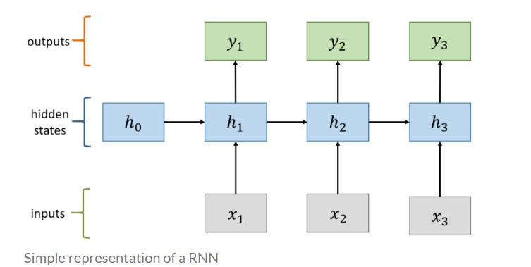
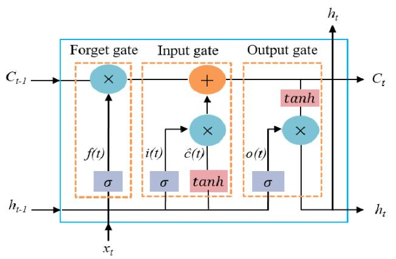
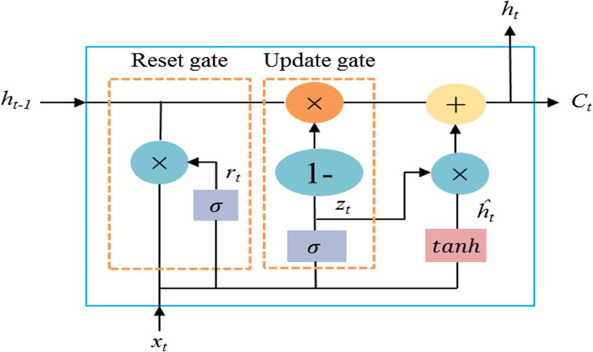

# Sentiment Analysis using RNN, LSTM & GRU

**A comparative study of three recurrent neural network architectures for binary sentiment classification on the IMDb Movie Reviews Dataset.**

## Table of Contents

- [Overview](#overview)
- [Theory & Architecture Diagrams](#theory--architecture-diagrams)
- [Project Structure](#project-structure)
- [Dataset](#dataset)
- [Methodology](#methodology)
- [Models](#models)
- [How to Run](#how-to-run)
- [Results](#results)
- [Deliverables](#deliverables)
- [Key Findings](#key-findings)


## Overview

This project builds and compares three recurrent architectures — **Simple RNN**, **LSTM**, and **GRU** — for classifying IMDb movie reviews as **positive** or **negative**. All three models share an identical preprocessing pipeline, embedding layer, and training configuration, so that differences in performance can be attributed to the recurrent layer alone.

The project includes the underlying theory and mathematics for each architecture, a full implementation, a rigorous evaluation (Accuracy, Precision, Recall, F1-score, Confusion Matrix), and an analysis of *why* the results turn out the way they do.


## Theory & Architecture Diagrams

### 1. Why Sequence Models?

Sentiment Analysis is a **binary classification** task (`1 = positive`, `0 = negative`) where meaning depends heavily on **word order** — `"not good"` is the opposite of `"good"`, but a bag-of-words model treats both the same because it discards order. Recurrent Neural Networks solve this by reading a review **one word at a time** while keeping a **hidden state** — a running memory of everything seen so far in the sequence.

### 2. Simple RNN

<p align="center"></p>

A Simple RNN updates its hidden state at every time step using the same shared weights:

$$h_t = \tanh(W_x x_t + W_h h_{t-1} + b_h)$$

- $x_t$ — input embedding at time step $t$
- $h_{t-1}$ — hidden state (memory) carried from the previous step
- $W_x, W_h$ — weight matrices, **reused at every time step**

**Weakness:** because $W_h$ is multiplied into the hidden state repeatedly across time steps, gradients shrink or explode as they're backpropagated through a long sequence — this is the **vanishing gradient problem**, and it means Simple RNN effectively "forgets" information from early in a long review by the time it reaches the end.



### 3. LSTM (Long Short-Term Memory)

<p align="center"></p>

LSTM (Hochreiter & Schmidhuber, 1997) fixes the vanishing-gradient problem by adding a separate **cell state** $C_t$, regulated by three gates:

| Gate | Formula | Role |
|---|---|---|
| **Forget** | $f_t = \sigma(W_f[h_{t-1}, x_t] + b_f)$ | decides what to discard from memory |
| **Input** | $i_t = \sigma(W_i[h_{t-1}, x_t] + b_i)$ | decides what new information to add |
| **Output** | $o_t = \sigma(W_o[h_{t-1}, x_t] + b_o)$ | decides what part of memory to expose |

Cell state update: $C_t = f_t \odot C_{t-1} + i_t \odot \tilde{C}_t$, followed by $h_t = o_t \odot \tanh(C_t)$.

Because this update is largely **additive** rather than repeatedly multiplicative, gradients can flow across long sequences without vanishing — giving LSTM the strongest long-term memory of the three architectures.


### 4. GRU (Gated Recurrent Unit)

<p align="center"></p>

GRU (Cho et al., 2014) simplifies LSTM by merging the cell state and hidden state into one, using only **two gates**:

| Gate | Formula | Role |
|---|---|---|
| **Update** | $z_t = \sigma(W_z[h_{t-1}, x_t] + b_z)$ | balances how much old vs. new information to keep |
| **Reset** | $r_t = \sigma(W_r[h_{t-1}, x_t] + b_r)$ | decides how much past information to ignore |

$$h_t = (1-z_t)\odot h_{t-1} + z_t \odot \tilde{h}_t$$

GRU has **~25% fewer parameters** than LSTM (2 gates instead of 3, no separate cell state), which usually makes it faster to train while achieving comparable accuracy — a good default when compute or time is limited.


### 5. Overall Model Architecture

<p align="center"></p> 

All three models share the exact same skeleton — only the recurrent layer changes:

```
Input → Embedding(128) → [SimpleRNN | LSTM | GRU](64) → Dropout(0.4) → Dense(1, sigmoid)
```

This keeps the comparison fair: any performance difference comes from the recurrent layer itself, not from a different pipeline.

### Quick Theory Comparison

| Aspect | Simple RNN | LSTM | GRU |
|---|---|---|---|
| Memory | Single hidden state | Hidden + cell state | Single hidden state |
| Gates | None | Forget, Input, Output | Update, Reset |
| Long-range handling | Poor (vanishing gradients) | Excellent | Very good |
| Parameters | Fewest | Most | ~25% fewer than LSTM |
| Training speed | Fastest per step | Slowest per step | Faster than LSTM |


## Project Structure

```
4th week/
├── IMDB_MOVIE_dataset.csv                  # Dataset (review, sentiment columns)
├── Sentiment_Analysis_RNN_LSTM_GRU.ipynb   # Main notebook — theory, math, diagrams, full implementation (TensorFlow/Keras)
├── train_pytorch_and_save.py               # PyTorch implementation — trains RNN/LSTM/GRU, saves best_model.pth
├── Performance_Comparison_Table.md         # Accuracy / Precision / Recall / F1 / training time per model
├── Sentiment_Analysis_Presentation.pptx    # 10-slide project summary with diagrams
├── best_model_<NAME>.keras / .h5           # Saved best model — Keras format (from the notebook)
├── best_model_<NAME>.pth                   # Saved best model — PyTorch format (from train_pytorch_and_save.py)
├── performance_comparison.csv              # Metrics exported by the PyTorch script
├── images/                                 # Diagrams used in this README
│   ├── rnn_diagram.png
│   ├── lstm_diagram.png
│   ├── gru_diagram.png
│   └── model_architecture.png
└── README.md
```

## Dataset

| | |
|---|---|
| **Source** | IMDb Movie Reviews |
| **Size** | 50,000 reviews |
| **Class balance** | 25,000 positive / 25,000 negative |
| **Columns** | `review` (raw text), `sentiment` (`positive` / `negative`) |

## Methodology

```
Raw Text → Cleaning → Tokenization → Vocabulary → Sequences → Padding → Model
```

1. **Cleaning** — lowercase, strip HTML tags (e.g. `<br />`), remove punctuation/digits, collapse whitespace.
2. **Tokenization** — split cleaned text into word tokens.
3. **Vocabulary** — top 10,000 most frequent words; rare words map to `<OOV>`.
4. **Sequences** — words converted to integer IDs.
5. **Padding** — every review fixed to length 200 (pad or truncate).

## Models

All three models use the same architecture skeleton — only the recurrent layer differs:

```
Input → Embedding(128) → [SimpleRNN | LSTM | GRU](64) → Dropout(0.4) → Dense(1, sigmoid)
```

| Model | Gates | Memory | Notes |
|---|---|---|---|
| Simple RNN | None | Single hidden state | Fastest, but loses long-range context (vanishing gradients) |
| LSTM | Forget, Input, Output | Hidden state + cell state | Best long-term memory control |
| GRU | Update, Reset | Single hidden state | ~25% fewer parameters than LSTM, faster to train |

## How to Run

### Option A — Notebook (TensorFlow/Keras)
```bash
pip install tensorflow scikit-learn pandas matplotlib seaborn
```
Open `Sentiment_Analysis_RNN_LSTM_GRU.ipynb` and run all cells. The best model is saved automatically as `best_model_<NAME>.keras` / `.h5`.

### Option B — PyTorch script (produces `.pth`)
```bash
pip install torch scikit-learn pandas numpy
python train_pytorch_and_save.py
```
Trains all three models, prints metrics, and saves `performance_comparison.csv` and `best_model_<NAME>.pth`.

> Both options require `IMDB_MOVIE_dataset.csv` in the same folder. After running either one, update `Performance_Comparison_Table.md` and the presentation's results slide with the real metrics produced.

## Results

Final numbers are produced by running the notebook or script locally (see `comparison_df` / `performance_comparison.csv`) and should be copied into [`Performance_Comparison_Table.md`](Performance_Comparison_Table.md):

| Model | Accuracy | Precision | Recall | F1-score | Training Time (s) |
|---|---|---|---|---|---|
| Simple RNN | _fill in_ | _fill in_ | _fill in_ | _fill in_ | _fill in_ |
| LSTM | _fill in_ | _fill in_ | _fill in_ | _fill in_ | _fill in_ |
| GRU | _fill in_ | _fill in_ | _fill in_ | _fill in_ | _fill in_ |

## Deliverables

- ✅ Jupyter Notebook — theory, mathematics, diagrams, full implementation (TensorFlow/Keras)
- ✅ PyTorch training script — saves best model as `.pth`
- ✅ Performance comparison table
- ✅ Presentation deck (10 slides, diagram-led)
- ✅ README (this file)

## Key Findings

- **Gated architectures (LSTM, GRU) outperform Simple RNN** on long text such as movie reviews, because their gating mechanisms avoid the vanishing-gradient problem that limits Simple RNN's memory to short spans.
- **GRU trains faster than LSTM** (fewer gates → fewer computations per time step) while typically achieving comparable accuracy — a good default when compute or time is limited.
- **LSTM gives the most explicit control over long-term memory** via its dedicated cell state, making it the strongest choice when handling very long or complex sequences.

